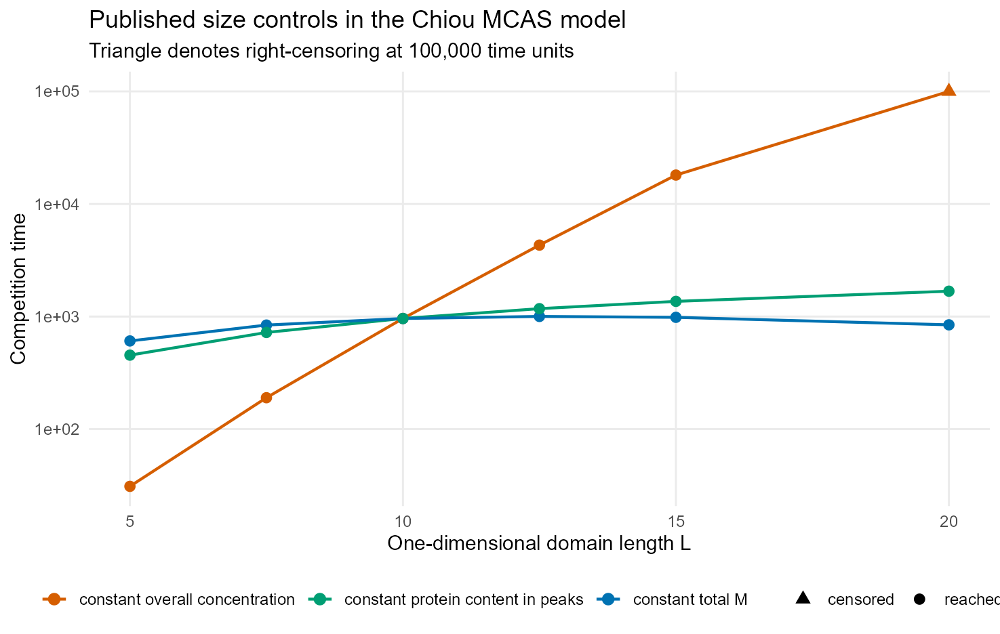
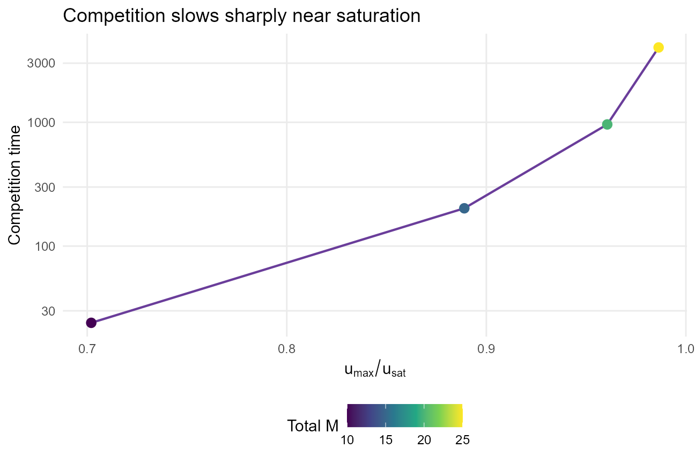
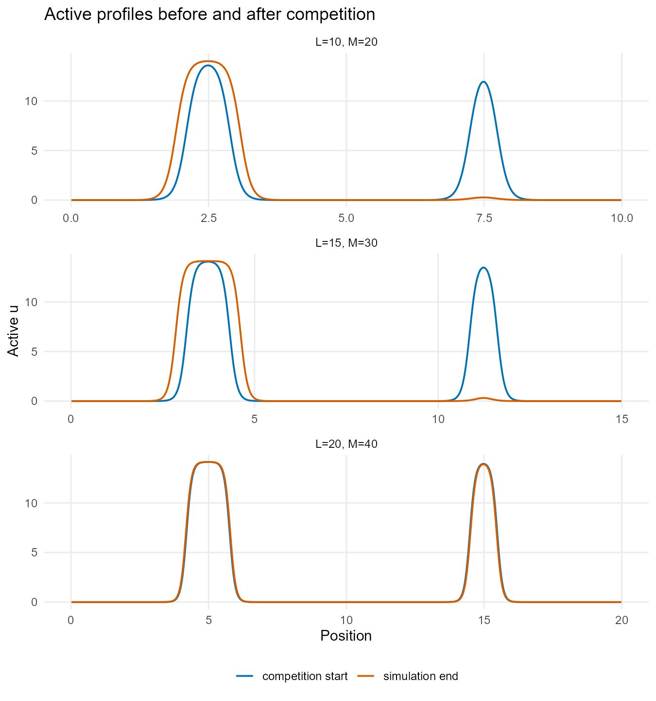
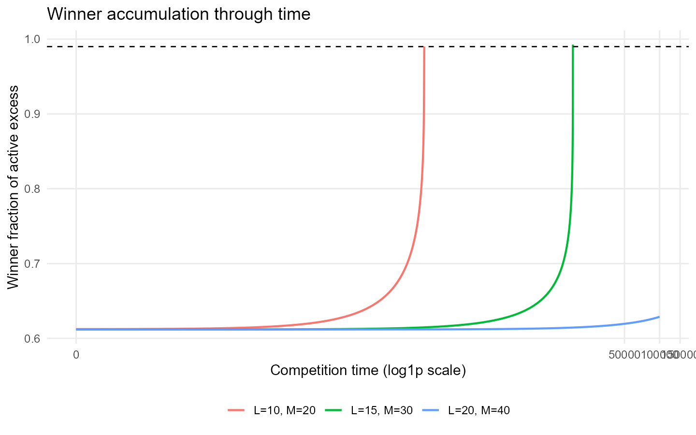

```{r setup, include=FALSE}
knitr::opts_chunk$set(echo = FALSE, message = FALSE, warning = FALSE)
source("../R/chiou_mcas.R")
```

[&larr; Report catalogue](../index.html)

> **Status: supplementary MATLAB model port, native-length reproduction, and separate WGD adapter.** The
> published experiment changes a one-dimensional domain length. It is not a
> literal cell-volume or whole-genome-duplication experiment.

# Source and implementation boundary

The source of truth is the authors' supplementary MATLAB implementation in
`dev/chiou/MATLAB_code`, especially `Main1D_color_plot.m` and the supplied
`initial_state_1D.mat`. The port retains the figure script's reaction

\[
F(u,v)=a u^2v-bu,
\]

periodic boundary conditions, (D_u=0.01), (D_v=1), (a=b=1), baseline
(L=10), baseline total mass (M=20), adaptive explicit reaction step, and
implicit diffusion step. `Parameters.m` also supplies a distinct, saturating
variant (F=a u^2v/(1+ku^2)-bu), with (k=0.01); it is preserved in the
module but is not silently substituted for the Fig. 6 model.

The archived figure script refers to legacy variable and file names not defined
by its included `Parameters.m`. Those names are reconciled only where the
archive itself is unambiguous (`Cellsize=L`, `Dconst_u=Du`, `Dconst_v=Dv`, and
`initial_state.mat=initial_state_1D.mat`).

# Competition protocol

The two competitors are not arbitrary Gaussian bumps. The original one-peak
profile is placed in each half-domain, the two halves receive 60% and 40% of
the total protein, and each periodic half-domain equilibrates in isolation.
The barrier is then removed. Competition time is the first saved time at which
one half contains 99% of the active protein above the shared background,
`u - min(u)`. Total `u+v` is still conserved and reported separately, but is
not an appropriate winner/loser endpoint because fast cytoplasmic `v` remains
distributed across both halves. Simulations that do not reach the active-peak
criterion within the observation window are reported as censored.

Every run returns competition time, winner and loser mass through time, peak
heights and full widths at half height, peak separation, maximum (u), the
saturation index (u_{max}/u_{sat}), total mass, mean concentration, and final
peak count. The analytic values copied from the MATLAB analysis are

\[
u_{sat}=\sqrt{\frac{2bD_v}{aD_u}},\qquad
q_{sat}=\sqrt{\frac{9bD_u}{2aD_v}}.
\]

# Published size experiment

Fig. 6 varies native one-dimensional length (L) under three controls:

1. **Constant overall concentration:** (M\propto L). Peaks approach
   saturation and competition slows sharply.
2. **Constant total mass:** (M) is fixed. Enlargement dilutes the protein and
   competition becomes faster.
3. **Constant protein in peaks:** only background material
   (q_{sat}(L-L_0)) is added. Peak shape/content is preserved, isolating the
   weaker, gradual effect of peak separation.

The native-resolution suite passes all three qualitative validation targets.
Low-mass, unsaturated peaks compete rapidly; near-saturated mesas compete much
more slowly; and competition time rises sharply as
(u_{max}/u_{sat}) approaches one.

```{r fig6-result, out.width="100%"}

```

At constant concentration, competition time rises from 31 at (L=5) to 190,
961, 4,311, and 18,067 as (L) reaches 15; the (L=20) case remains
right-censored at 100,000. At fixed total mass, the enlarged (L=20) domain
competes in 844 time units versus 961 at baseline. Preserving peak content
gives the gradual, sub-linear series 961, 1,175, 1,364, and 1,679 for
(L=10,12.5,15,20).

```{r saturation-result, out.width="90%"}

```

The independent mass series gives competition times 24, 202, 961, and 4,021
as the saturation index rises from 0.702 to 0.986.

```{r profiles-result, out.width="90%"}

```

```{r trajectories-result, out.width="100%"}

```

The native 500-bin suite is run by `scripts/run_chiou_full_reproduction.R`.
Independent conditions are checkpointed and can be distributed across worker
processes; report rendering only reads the compact versioned snapshot.

# Separate WGD adapter

Only after the native-length reproduction is assessed do we map a requested
volume ratio to the one-dimensional model:

\[
L/L_0=(V/V_0)^{1/3}.
\]

Thus a literal two-fold volume change maps to (2^{1/3}=1.260)-fold length,
not two-fold length. Total abundance is independent and is specified as
(M/M_0=(V/V_0)^\alpha). The adapter reports both assumptions explicitly so
geometry and abundance cannot be conflated.

# Limitations

This is a one-dimensional periodic competition model, not a three-dimensional
cell. Its competition time is mathematical and should be compared with a
declared biological observation window: two sites may be functionally
multipolar even if one would eventually win after many hours.
