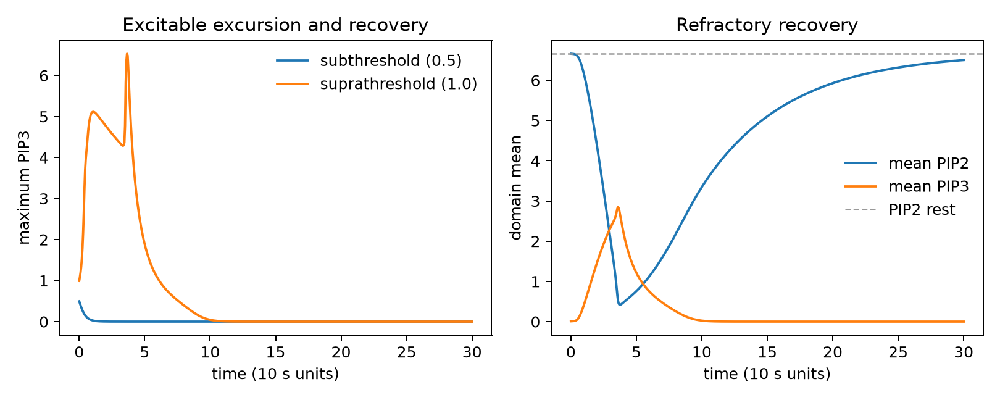
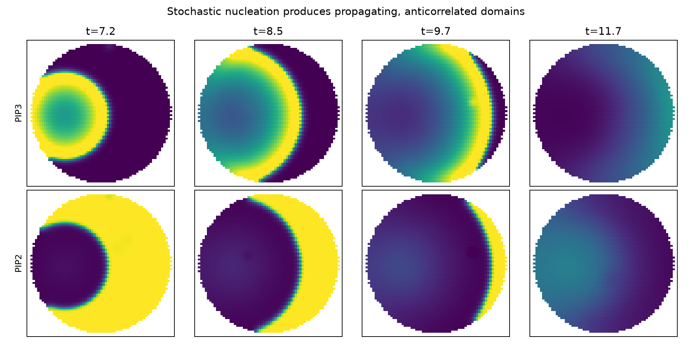
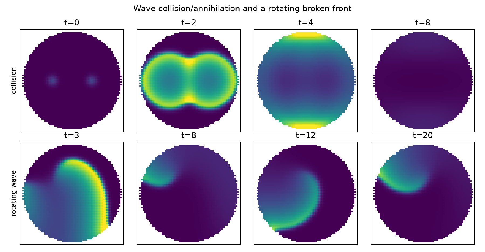
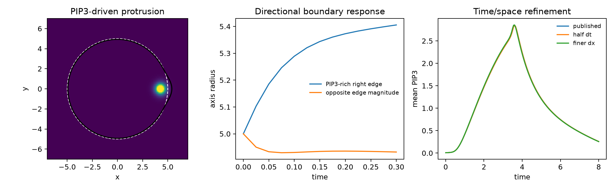

# Taniguchi PIP2/PIP3 excitable-wave reproduction

## Scope and status

This is a port of the fixed-circle and deformable-cell equations supplied in
`docs/jobs/02_taniguchi.txt`. It is a source-model reproduction only. No cell
size or WGD perturbation was attempted, and the implementation does not expose
one. The source article was not searched.

The fixed-domain acceptance layer passes the resting-state, excitation,
recovery, stochastic propagation, anticorrelation, collision/annihilation,
rotating-wave, and numerical-refinement checks. The deformable Fig. 4F
parameter set passes the local mechanochemical direction check: a PIP3 patch
at the right boundary protrudes while the PIP2-rich opposite boundary
retracts. A full long stochastic Fig. 4F--I morphology comparison remains a
production SLURM run, so this port does not claim pixel-level reproduction.

## Acceptance evidence



A 0.5-amplitude perturbation decays immediately, whereas a 1.0-amplitude
perturbation produces a large excursion (`peak PIP3 = 6.53`) and returns to a
negligible mean PIP3 level by `t=15`. PIP2 recovery is slower, as expected for
the refractory variable; the plotted run continues to `t=30` to show its
return to the resting level.



With the published fixed-circle noise process (`K_K=5.7`, seed 4), 19 events
occur by `t=20`. The largest wave covers 93.8% of the masked domain and the
median spatial PIP2/PIP3 correlation during nonuniform states is -0.873.



Two triggered fronts collide and disappear into the refractory wake. A
broken-front initial condition curls and continues rotating through `t=20`.
The imposed initial states are acceptance probes, not source-paper initial
conditions.



For the exact Fig. 4F parameters and published `dx=0.1`, `dt=8e-5`, an imposed
right-edge PIP3 patch increases the right axis radius from 5.000 to 5.406 while
the opposite radius decreases to 4.932. In the fixed-circle excitation, the
peak mean PIP3 is 2.84912 at the published resolution, 2.84912 at half the
timestep, and 2.85501 on the finer lattice.

Machine-readable values are in
`assets/taniguchi/v1/acceptance_metrics.json`. Regenerate every figure with:

```bash
conda run -n scaling_sandbox python scripts/validate_taniguchi.py
```

## Numerical limitations

The source does not specify the exact diffuse-interface initialization or the
timestep interpretation of stochastic firing, so the implementation uses the
two explicit reconstructions requested in the job. The concentration cutoff
in the vanishing phase-field tail is an additional disclosed numerical
regularization. The fixed circular boundary is rasterized on the source's
triangular lattice and thus converges geometrically rather than representing
an exact circle at finite spacing.

The Movie S3 parameter sets are mentioned but not numerically included in the
job file. Because those cases are optional, they were not needed for this
implementation and were not recovered from the internet.
